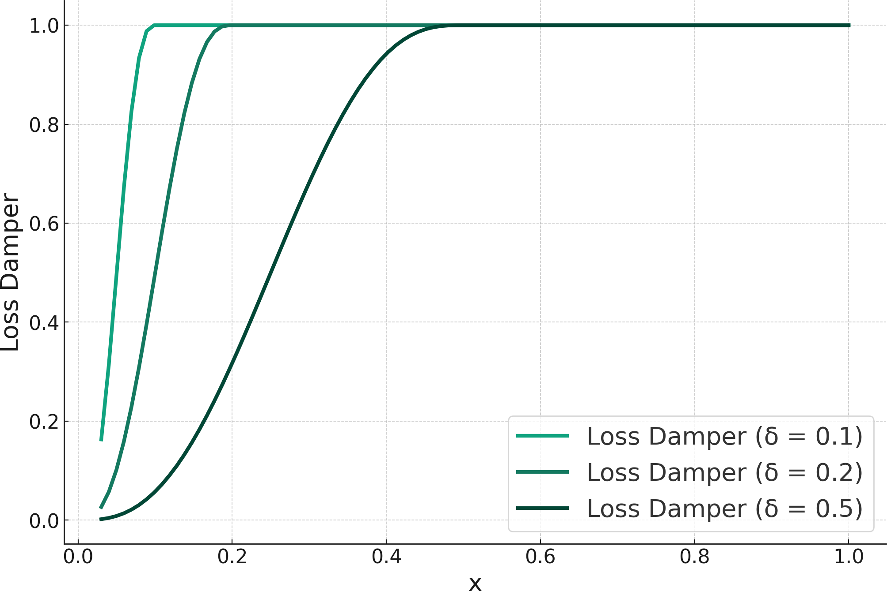
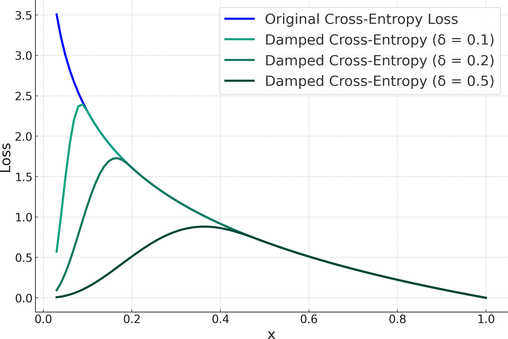
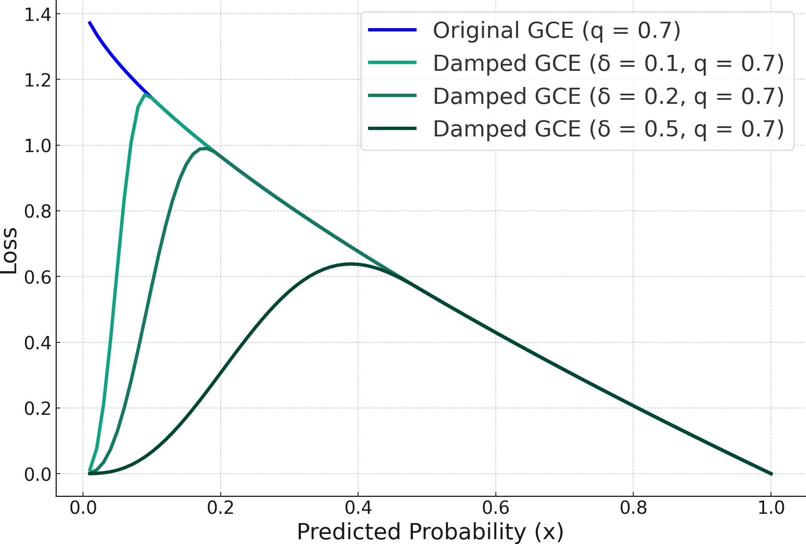
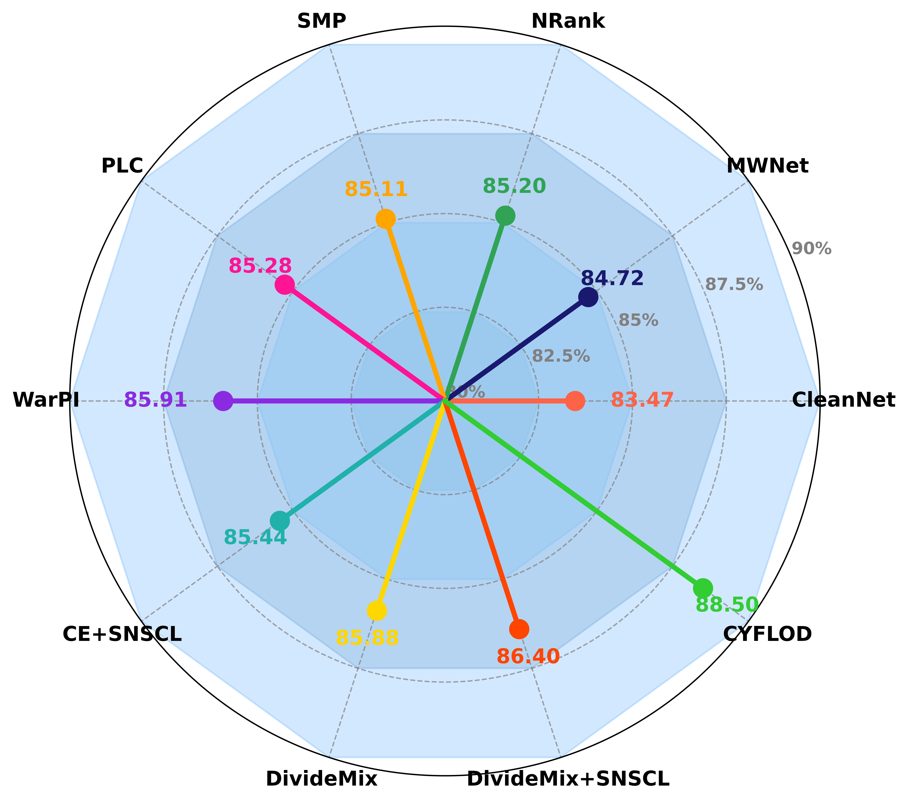
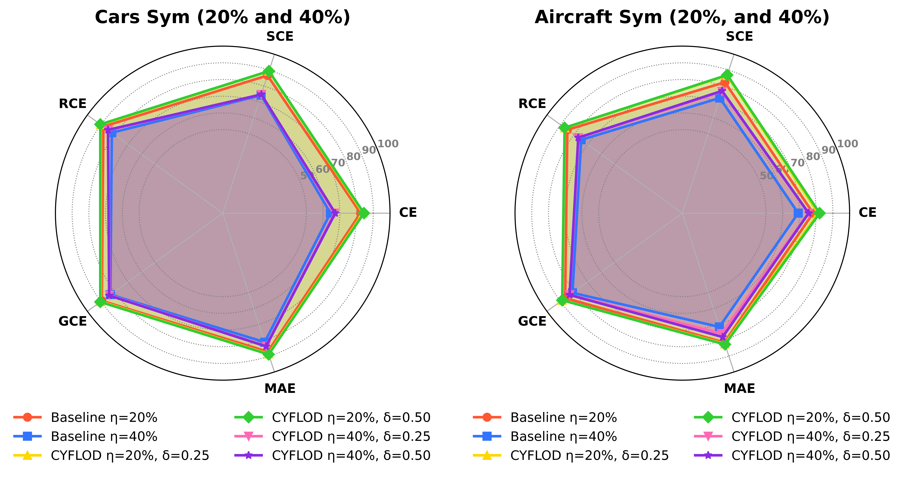

# CYFLOD: Cyclic Filtering and Loss Damping for Combating Noisy Labels in Fine-grained Visual Classification
# 1.  Challenges in LNL

Fig.1 LNL Challenges. Top: random noise due to mislabeled classes (blue rectangles) in the generic CIFAR-10 (left) and the fine-grained Stanford Cars (right) data sets. Bottom: dependent noise due to confusion of classes like ``deer'' and ``dog'' (red rectangles) for the generic CIFAR-10 and inter-class overlap between similar vehicles in the fine-grained Standford Cars (right) data sets.
# 2. CYFLOD Overview

Fig.2 CYFLOD Training Overview: he proposed training scheme starts with the full, noisy data set. We feed the data to the model and
train the model using transfer learning: a cyclic cleansing process combined with a loss damping iteratively removes the noisy samples.
|  |  |  |
|------------------------------|------------------------------|------------------------------|

Fig.3 Loss damping. Left: examples of loss damping functions with different $\delta$ values. Right: effect of loss damping on cross-entropy loss.
# 3. Results

### Table 1. Data sets used in this study

| Data Set                        | Type                  | Total Images | Classes | Train  | Test   |
|---------------------------------|-----------------------|--------------|---------|--------|--------|
| Stanford Cars [[Ref]](https://cs.stanford.edu/people/karpathy/cars196/) | Fine-grained         | 16,185       | 196     | 8,144  | 8,041  |
| Aircraft [[Ref]](https://www.robots.ox.ac.uk/~vgg/data/fgvc-aircraft/)  | Fine-grained         | 10,000       | 100     | 6,667  | 3,333  |
| CIFAR-10 [[Ref]](https://www.cs.toronto.edu/~kriz/cifar.html)          | Generic              | 60,000       | 10      | 50,000 | 10,000 |
| Food-101 [[Ref]](https://data.vision.ee.ethz.ch/cvl/datasets_extra/food-101/) | Real-world Noisy     | 101,000      | 101     | 75,750 | 25,250 |

|  |  |  |
|------------------------------|------------------------------|------------------------------|

# 3.1 Results on two Fine-grained Datasets
We conducted extensive experiments on two fine-grained datasets, i.e., Stanford Cars and Aircraft, with a # Symmetric noise ratio of {20%. 40% }and Asymmetric noise ratios of {10%, 30%}.

### Table 2. Test accuracy comparison (\%) with recent SOTA SNSCL[[Ref]](https://openaccess.thecvf.com/content/CVPR2023/papers/Wei_Fine-Grained_Classification_With_Noisy_Labels_CVPR_2023_paper.pdf) on Stanford Cars, and Aircraft datasets, for both symmetric and asymmetric label noise at two different ratios.

### Symmetric Noise
| **Dataset**      | **Method**                                                   | **Sym. (20%)** | **Sym. (40%)** |
|-------------------|--------------------------------------------------------------|----------------|----------------|
| **Stanford Cars** | CE+SNSCL                                                    | 83.24          | 76.72          |
|                   | GCE+SNSCL                                                   | 73.78          | 58.11          |
|                   | SCE+SNSCL                                                   | 82.58          | 79.07          |
|                   | DivideMix+SNSCL                                             | 86.29          | 80.09          |
|                   |  (RCE + δ = 0.5) | **90.46**       | **84.79**       |
| **Aircraft**      | CE+SNSCL                                                    | 76.45          | 70.48          |
|                   | GCE+SNSCL                                                   | 72.67          | 64.70          |
|                   | SYM+SNSCL                                                   | 79.64          | 74.02          |
|                   | DivideMix+SNSCL                                             | 82.31          | 80.11          |
|                   |  (GCE + δ = 0.25) | **88.74**       | **83.19**       |

### Asymmetric Noise

| **Dataset**      | **Method**                                                   | **Asym. (10%)** | **Asym. (30%)** |
|-------------------|--------------------------------------------------------------|-----------------|-----------------|
| **Stanford Cars** | CE+SNSCL                                                    | 83.73           | 70.04           |
|                   | GCE+SNSCL                                                   | 80.33           | 64.64           |
|                   | SYM+SNSCL                                                   | 83.84           | 74.45           |
|                   | DivideMix+SNSCL                                             | 88.18           | 81.20           |
|                   |  (RCE + δ = 0.5) | **90.28**        | **82.35**        |
| **Aircraft**      | CE+SNSCL                                                    | 78.28           | 65.44           |
|                   | GCE+SNSCL                                                   | 73.85           | 63.34           |
|                   | SYM+SNSCL                                                   | 78.34           | 71.13           |
|                   | DivideMix+SNSCL                                             | 84.17           | 80.55           |
|                   |  (GCE + δ = 0.25) | **88.32**        | **76.50**        |

### Table 3. Test Accuracy (%) on Stanford Cars and Aircraft Data Sets with Symmetric Label Noise (η = 20% and η = 40%)

| **Data Set**       | **Loss Function** | **η = 20%** | **η = 40%** | **δ = 0.25 (η = 20%)** | **δ = 0.50 (η = 20%)** | **δ = 0.25 (η = 40%)** | **δ = 0.50 (η = 40%)** |
|---------------------|-------------------|-------------|-------------|------------------------|------------------------|------------------------|------------------------|
| **Stanford Cars**   | CE               | 82.38       | 64.39       | **83.90** (+1.52)      | **84.41** (+2.03)      | **66.86** (+2.47)      | **67.26** (+2.87)      |
|                     | SCE              | 86.68       | 74.22       | **89.42** (+2.74)      | **88.98** (+2.30)      | **78.39** (+4.17)      | **74.70** (+0.48)      |
|                     | RCE              | 88.19       | 81.94       | **90.10** (+1.91)      | **90.46** (+2.27)      | **84.52** (+2.58)      | **84.79** (+2.85)      |
|                     | GCE              | 89.35       | 83.00       | **90.11** (+0.76)      | **89.90** (+0.55)      | **84.40** (+1.40)      | 81.91 (-1.09)          |
|                     | MAE              | 87.25       | 81.25       | **88.64** (+1.39)      | **88.95** (+1.70)      | **83.75** (+2.50)      | **83.88** (+2.63)      |
| **Aircraft**        | CE               | 78.19       | 69.28       | **81.15** (+2.96)      | **80.97** (+2.78)      | **75.45** (+6.17)      | **75.24** (+5.96)      |
|                     | SCE              | 82.42       | 72.49       | **86.64** (+4.22)      | **86.76** (+4.34)      | **80.28** (+7.79)      | **79.59** (+7.10)      |
|                     | RCE              | 84.94       | 74.71       | **86.88** (+1.94)      | **87.60** (+2.66)      | **76.95** (+2.24)      | **78.93** (+4.22)      |
|                     | GCE              | 86.56       | 81.16       | **88.74** (+2.18)      | **88.62** (+2.06)      | **83.19** (+2.03)      | 81.69 (+0.53)          |
|                     | MAE              | 81.43       | 71.65       | **82.32** (+0.89)      | **82.68** (+1.25)      | **75.84** (+4.19)      | **78.00** (+6.35)      |

### Table 4. Test Accuracy (%) on Stanford Cars and Aircraft Data Sets with Asymmetric Label Noise (η = 10% and η = 30%)

| **Data Set**       | **Loss Function** | **η = 10%** | **η = 30%** | **δ = 0.25 (η = 10%)** | **δ = 0.50 (η = 10%)** | **δ = 0.25 (η = 30%)** | **δ = 0.50 (η = 30%)** |
|---------------------|-------------------|-------------|-------------|------------------------|------------------------|------------------------|------------------------|
| **Stanford Cars**   | CE               | 86.26       | 73.21       | **88.99** (+2.73)      | **89.00** (+2.74)      | **75.88** (+2.67)      | **74.65** (+1.44)      |
|                     | SCE              | 88.73       | 74.26       | **90.67** (+1.94)      | **89.81** (+1.08)      | **77.81** (+3.55)      | **75.96** (+1.70)      |
|                     | RCE              | 88.61       | 71.83       | **90.27** (+1.66)      | **90.45** (+1.84)      | **74.28** (+2.45)      | **74.54** (+2.71)      |
|                     | GCE              | 88.42       | 76.22       | **90.01** (+1.59)      | **89.26** (+0.84)      | **77.72** (+1.50)      | 74.43                  |
|                     | MAE              | 88.77       | 67.85       | **90.12** (+1.35)      | **90.29** (+1.52)      | **70.63** (+2.78)      | **71.27** (+3.42)      |
| **Aircraft**        | CE               | 84.43       | 70.57       | **86.10** (+1.67)      | **85.60** (+1.17)      | **73.86** (+3.29)      | **75.72** (+5.15)      |
|                     | SCE              | 84.13       | 64.66       | **87.36** (+3.23)      | **86.91** (+2.78)      | **67.92** (+3.26)      | **65.19** (+0.53)      |
|                     | RCE              | 84.88       | 63.70       | **86.76** (+1.88)      | **87.06** (+2.18)      | **73.11** (+9.41)      | **68.56** (+4.84)      |
|                     | GCE              | 86.20       | 74.89       | **88.32** (+2.12)      | **87.90** (+1.70)      | **76.50** (+1.61)      | 70.11                  |
|                     | MAE              | 83.05       | 60.28       | **84.45** (+1.40)      | **84.74** (+1.69)      | **62.13** (+1.85)      | **62.67** (+2.39)      |

# 4.2 CIFAR-10
### Table 5. CIFAR-10 Accuracy (%) Comparison with SOTA Methods for Symmetric and Asymmetric Label Noise

| **Methods**                         | **Sym. (50%)** | **Sym. (80%)** | **Asym. (40%)** |
|-------------------------------------|----------------|----------------|-----------------|
| MoPro[Ref](https://openreview.net/pdf/129bfcc800abbeedcdbb1bdfc2e469f06974f5a8.pdf)                                | 95.60          | 90.10          | 93.00           |
| SLCLNL[Ref](https://openaccess.thecvf.com/content/CVPR2022/papers/He_Safe-Student_for_Safe_Deep_Semi-Supervised_Learning_With_Unseen-Class_Unlabeled_Data_CVPR_2022_paper.pdf)                               | --             | 91.13          | 93.17           |
| SNSCL[Ref](https://openaccess.thecvf.com/content/CVPR2023/papers/Wei_Fine-Grained_Classification_With_Noisy_Labels_CVPR_2023_paper.pdf)                                | 95.20          | 91.70          | 94.90           |
| **** (RCE + δ = 0.25) | **96.71**       | **92.25**       | **95.23**        |
| **** (MAE + δ = 0.25) | **96.57**       | **91.86**       | **95.96**        |

### Table 6. CIFAR-10 F1 Score Comparison for CYFLOD and Recent Methods with Symmetric (60%) and Asymmetric (30%) Noise

| **Noise Type**                     | **Sym. (60%)**          | **Asym. (30%)**         |
|------------------------------------|-------------------------|-------------------------|
| Avg. Encoder[[Ref]](https://people.csail.mit.edu/danielzoran/EPLLICCVCameraReady.pdf)                       | 94.1 ± 0.14            | 85.4 ± 0.19            |
| AUM[[Ref]](https://arxiv.org/pdf/2001.10528)                                | 75.4 ± 0.22            | 46.4 ± 0.30            |
| CL[[Ref]](https://arxiv.org/pdf/1911.00068)                                 | 88.7 ± 0.56            | 91.9 ± 0.12            |
| CORES[[Ref]](https://arxiv.org/pdf/2010.02347)                              | 92.9 ± 0.17            | 26.7 ± 0.44            |
| SIMIFEAT-V[[Ref]](https://arxiv.org/pdf/2110.06283)                         | **94.6 ± 0.06**         | 84.7 ± 0.17            |
| SIMIFEAT-R[[Ref]](https://arxiv.org/pdf/2110.06283)                         | 92.9 ± 1.84            | 84.0 ± 0.13            |
| DynaCor[[Ref]](https://arxiv.org/pdf/2405.19902)                            | 93.6 ± 0.18            | 94.2 ± 0.45            |
| **** (EfficientNet-B4+CE + δ=0.25) | 93.66                  | **96.21**              |
| **** (EfficientNet-B4+MAE + δ=0.25) | **95.71**              | **96.31**              |
| **** (EfficientNet-B4+RCE + δ=0.25) | **95.56**              | **96.81**              |
| **** (ResNet-34+RCE + δ=0.25)       | 94.15                  | 93.80                  |

# 3.2 Food-101
### Table 7. Baseline Vs. CYFLOD: Test Accuracy (%) on CIFAR-10 Dataset with Symmetric and Asymmetric Label Noise.
| **Loss Function** | **Sym. (50%) Baseline** | **Sym. (80%) Baseline** | **Sym. (50%, δ = 0.25)** | **Sym. (80%, δ = 0.25)** | **Asym. (40%) Baseline** | **Asym. (40%, δ = 0.25)** |
|--------------------|--------------------------|--------------------------|--------------------------|--------------------------|--------------------------|--------------------------|
| CE                 | 95.56                   | 90.89                   | **95.58** (+0.02)       | 90.10                   | 91.12                   | **95.92** (+4.80)       |
| SCE                | 93.00                   | 90.34                   | **93.19** (+0.19)       | **92.12** (+1.78)       | 91.70                   | **92.00** (+0.30)       |
| RCE                | 94.62                   | 90.25                   | **96.71** (+2.09)       | **92.25** (+2.00)       | 94.05                   | **95.23** (+1.18)       |
| GCE                | 93.50                   | 90.43                   | **94.19** (+0.69)       | **91.25** (+0.82)       | 88.64                   | **88.71** (+0.07)       |
| MAE                | 94.61                   | 89.28                   | **96.57** (+1.96)       | **91.86** (+2.58)       | 94.65                   | **95.96** (+1.31)       |

# 5. How to Run the code ....
PyTorch Implementation of CYFLOD

# 5.1. Environment settings

Python 3.8, Pytorch 1.11, CUDA 11.1, Torchvision 12.2

# 5.2. Dataset

   Data considered in this study, you can download the dataset from original source as provided below.

   Stanford Car: https://www.kaggle.com/datasets/jessicali9530/stanford-cars-dataset
   
   Aircraft: https://www.robots.ox.ac.uk/~vgg/data/fgvc-aircraft/
   
   CIFAR-10: https://www.cs.toronto.edu/~kriz/cifar.html
   
   Food-101: https://vision.ee.ethz.ch/datasets_extra/food-101/

# 6. Training
To generate noise:

python noise_generator.py --datasetpath {car, aircraft, cifar10, Food-101} --noiseratio {0.1,0.2,0.3, ..., 0.80} --noisetype {sym,asym}

Different losses implementation with Dump is given  in dumped-losses.py

You can import the losses file in the main notebook, run and enjoy......

Cite

On publish ....
